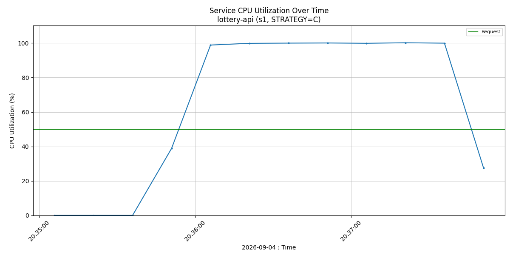
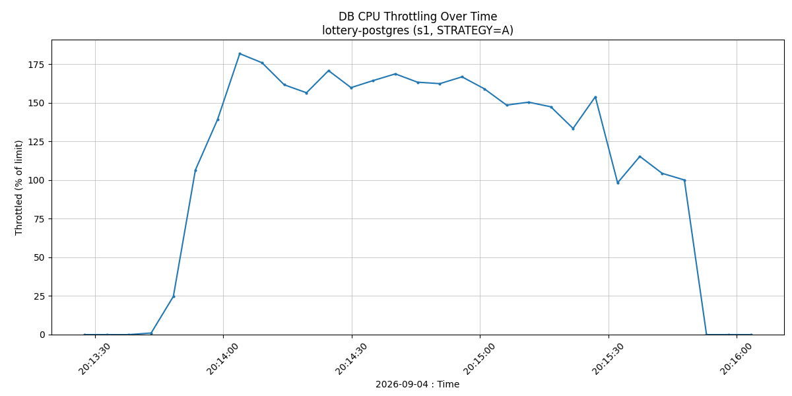
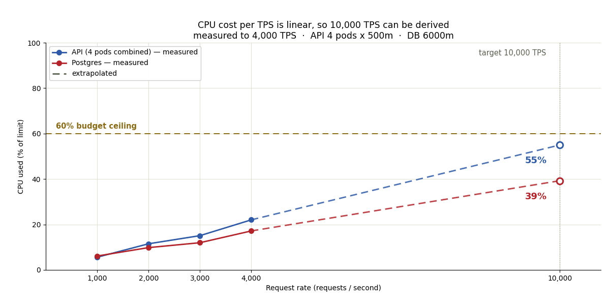
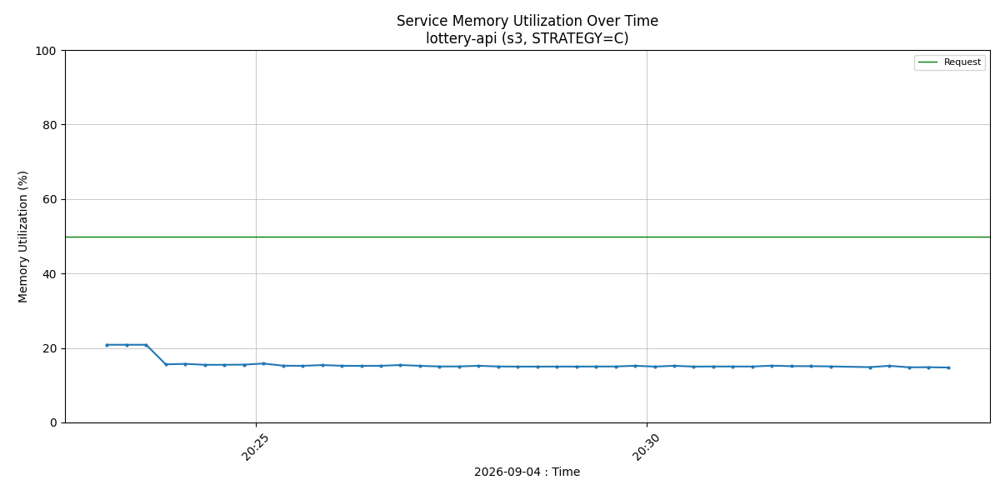
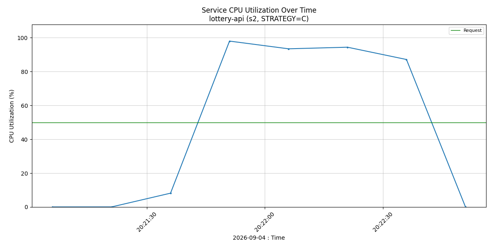

# Lottery Search System — Design Document

## 1. Metadata

| | |
|---|---|
| **Title** | Lottery Search System — Design Document |
| **Author** | Natthawat Narin, Senior Backend Developer |
| **Status** | Final — submitted for review |
| **Version** | 1.0 |
| **Date** | 2026-09-05 |
| **Reviewers** | — |
| **Repository** | <https://github.com/nthw-dev/challenge-lottery-search-system> — this document, the decision records, the full results analysis and every evidence bundle behind the numbers |
| **Proof of concept** | <https://github.com/nthw-dev/poc-lottery-search-system> — the solution architecture, data structures, algorithms and load tests that produced every measurement here |
| **Responds to** | [`challenge-lottery-search-system.md`](challenge-lottery-search-system.md) |
| **Decision log** | [`adr/`](adr/README.md) — eight architecture decision records (Appendix A) |

Every quantitative claim in this document is a measurement, not an estimate. A proof of concept was
built and load-tested on Kubernetes with enforced resource limits specifically to produce those
numbers; §8 indexes the raw evidence, and §9 lists what remains unproven.

---

## 2. Context and scope

The challenge: search 10,000,000 six-digit lottery tickets by a 6-character pattern with `*`
wildcards, and distribute matching tickets to concurrent users without ever handing the same ticket to
two people. The deliverable is a design, with a recommended storage technology, an indexing strategy
for wildcard matching, a performance analysis, and a concurrency strategy that prevents duplicate
distribution.

### 2.1 The insight the design rests on

A six-digit ticket has only **10⁶ = 1,000,000 possible values**. Ten million tickets therefore carry
an average of **ten tickets per distinct number**.

This reframes the problem. The naive reading is "search 10 million rows". The accurate reading is
"decide which of 1 million *numbers* match, then fetch tickets for those numbers". The second search
space is ten times smaller, it is fixed no matter how many tickets exist, and it is small enough to
stay permanently in cache. Every significant decision below follows from this.

The second thing to understand before reading any performance number is that **result-set size varies
by six orders of magnitude** with the number of wildcards:

| Pattern | wildcards | numbers matched | tickets matched |
|---|---|---|---|
| `123456` | 0 | 1 | ~10 |
| `123***` | 3 | 1,000 | ~10,000 |
| `****23` | 4 | 10,000 | ~100,000 |
| `**3***` | 5 | 100,000 | ~1,000,000 |
| `******` | 6 | 1,000,000 | 10,000,000 |

A design that is fast only for narrow patterns, or only for wide ones, has not solved the problem.
Performance must be reported per wildcard class, which is how §6.2 reports it.

A wildcard may appear in any position, so an ordinary B-tree on the ticket number is useful only when
the leading digits are fixed. `****23` cannot use it at all. That single fact is the technical core of
the challenge.

---

## 3. Goals and non-goals

### 3.1 Goals

Each goal was stated as a testable hypothesis before the proof of concept was built, and each is
paired here with what was measured.

| Goal | Target | Measured | Result |
|---|---|---|---|
| **G1** Wildcard search in any position at 10M rows, under a 500m-CPU / 128Mi API pod | p95 < 100 ms for every wildcard class at 100 concurrent users | p95 55.8 ms, flat across classes, 5,346 req/s | **met** (§6.2) |
| **G2** Many users searching the same pattern at once never receive the same ticket | zero duplicates under 200-way contention | 351,481 allocations, 0 duplicates, 0 ledger/state mismatches | **met** (§8.1) |
| **G3** The chosen index strategy beats a plain `LIKE` baseline by a wide margin at acceptable storage cost | ≥ 10× on the hardest pattern; index size comparable to alternatives | four orders of magnitude on the exact pattern; 192 MB of indexes versus 397 MB for the per-digit alternative | **met** (§6.2) |
| **G4** Stability under sustained mixed load within the pod's memory limit | no OOM kill, memory well under 128Mi across a 10-minute soak | 743,994 requests, 0 errors, 0 restarts, peak 27 MiB | **met** (§7.3) |

### 3.2 Non-goals

Deliberately out of scope, so that the design proves one database is sufficient before anything is
added to it:

- Authentication and authorization
- Payment flow, prize drawing, and draw-period scheduling
- Horizontal scaling of the database, replication, read replicas
- Any caching layer — Redis is excluded on purpose
- A production observability stack (Prometheus, Grafana, tracing)
- CI/CD pipeline

---

## 4. Overview

| | |
|---|---|
| **Recommended storage** | A single PostgreSQL instance — measured on 16, recommended on 17 (§6.4) |
| **Search method** | Resolve the pattern against a 1,000,000-row `numbers` dimension table, then join into `tickets` |
| **Distribution method** | `SELECT … FOR UPDATE SKIP LOCKED` inside one statement, plus an append-only allocation ledger |
| **Measured at 10M rows** | p95 56 ms at 5,346 req/s on one 500m-CPU pod; 351,481 concurrent allocations with zero duplicates |

The design is one stateless API in front of one PostgreSQL database holding three tables. A search
first decides which of the one million possible numbers match the pattern, using a small static
table indexed per digit, and only then touches the ten-million-row ticket table. An allocation is a
single SQL statement whose row locks make it impossible for two users to receive the same ticket,
with the outcome written to an audit ledger in the same transaction. Nothing else exists: no cache,
no lock service, no search engine.

---

## 5. Detailed design

### 5.1 Architecture and API

```
                    ┌──────────────────────────┐
   clients ────────▶│  API (stateless, N pods) │
                    │  · validate pattern      │
                    │  · build predicate       │
                    │  · one SQL round trip    │
                    └────────────┬─────────────┘
                                 │ SQL
                    ┌────────────▼─────────────┐
                    │        PostgreSQL        │
                    │  tickets    (10M rows)   │
                    │  numbers    (1M rows)    │
                    │  allocations (ledger)    │
                    └──────────────────────────┘
```

There is deliberately nothing else. No cache tier, no queue, no lock service, no search engine. Every
component that does not exist cannot fail, cannot drift out of sync with the database, and does not
need to be operated. The concurrency guarantee the challenge asks for is provided by the database's
own row locking, so the usual reason to add Redis disappears (§5.4).

The API is stateless, which is what makes horizontal scaling the answer to throughput (§7.2).

**Endpoints**

| Method | Path | Purpose |
|---|---|---|
| `POST` | `/v1/search` | Preview matches. Reserves nothing. Result limit capped at 100. |
| `POST` | `/v1/allocate` | Atomically reserve matching tickets for a user. Limit capped at 20. |
| `POST` | `/v1/release` | Return reserved tickets to the pool. |
| `GET` | `/healthz` | Liveness. Process only — never touches the database (§7.3). |
| `GET` | `/readyz` | Readiness. Pings the database. |

**Input validation.** A pattern must match `^[0-9*]{6}$` and is rejected at the handler before any
database work. This is both a correctness rule and the reason the predicate builder can inline digits
into SQL safely.

**Result counts are estimated, never counted.** A response reports `matched_count` as
`10^wildcards × tickets-per-number`. Running a real `COUNT(*)` for `**3***` would scan a million rows
to produce a number the user does not need to be exact.

### 5.2 Data model

```sql
CREATE TABLE tickets (
  id          bigint    PRIMARY KEY,
  number      int       NOT NULL,            -- 0..999999
  status      smallint  NOT NULL DEFAULT 0,  -- 0=available, 1=reserved, 2=sold
  reserved_by int,
  reserved_at timestamptz
);

CREATE TABLE numbers (                       -- the 1M-row search space, §2.1
  n  int PRIMARY KEY,                        -- 0..999999
  d1 smallint NOT NULL, d2 smallint NOT NULL, d3 smallint NOT NULL,
  d4 smallint NOT NULL, d5 smallint NOT NULL, d6 smallint NOT NULL
);

CREATE TABLE allocations (                   -- append-only ledger
  ticket_id bigint      NOT NULL,
  user_id   int         NOT NULL,
  at        timestamptz NOT NULL DEFAULT now()
);
```

| Decision | Reason |
|---|---|
| `number` is `int`, not `char(6)` | Saves roughly 60 MB at 10M rows, compares faster, and digits can be extracted arithmetically without a type conversion. Zero-padding is a presentation concern, applied on output. |
| Digits are **not** stored on `tickets` | Six `GENERATED … STORED` columns would add roughly 120 MB to the heap. The digit columns live on the 1M-row `numbers` table instead, where they cost a fraction of that. |
| `status` is `smallint` | Smaller and faster to compare than an enum or text, and sufficient for three states. |
| A separate `allocations` ledger | Makes the duplicate-distribution guarantee **auditable with one query** rather than inferred. This is the evidence behind §5.4 and §8.1. |

`numbers` is a static lookup table: 1,000,000 rows generated once, never written again. It is the
reason the design scales to more tickets without the search cost changing.

### 5.3 Search algorithm and indexes

For a pattern such as `1*3**6`:

1. **Validate** the pattern, then split it into fixed digits and wildcards.
2. **Resolve the number space.** Find the set of `n` in `numbers` matching the fixed digit positions.
   Two cases are handled specially because they collapse to a range or a point:
   - *Leading digits fixed* (`123***`) → `n BETWEEN 123000 AND 123999`, a primary-key range scan.
   - *All six digits fixed* (`123456`) → skip `numbers` entirely and use `number = 123456`.
   - Otherwise → per-digit B-tree indexes on `d1..d6`.
3. **Fetch tickets** by joining the resulting numbers into `tickets(number)` through a partial B-tree
   index restricted to `status = 0`.
4. **Stop early.** The `LIMIT` is pushed into the scan so the query stops as soon as the requested page
   is filled.

```sql
-- 123***  → a primary-key range on the 1M-row table
SELECT id, number FROM tickets
WHERE status = 0
  AND number IN (SELECT n FROM numbers WHERE n BETWEEN 123000 AND 123999)
LIMIT 20;

-- ****23  → per-digit indexes on the 1M-row table
SELECT id, number FROM tickets
WHERE status = 0
  AND number IN (SELECT n FROM numbers WHERE d5 = 2 AND d6 = 3)
LIMIT 20;
```

**Indexes**

```sql
CREATE INDEX idx_n_d1 ON numbers (d1);   -- …through d6, ~6.8 MB each
CREATE INDEX idx_tickets_number ON tickets (number) WHERE status = 0;
```

Seven indexes in total, **192 MB** at 10M tickets. The `numbers` half of that (103 MB) is fixed
forever; only `idx_tickets_number` grows with the ticket count, and being partial on `status = 0`
it *shrinks* as inventory is sold.

**Two design rules that the measurements forced**

*No `ORDER BY` on search.* The obvious `ORDER BY id LIMIT 20` turned out to be the single largest
cost in the whole system. At 10M rows it makes the planner walk the primary key and probe `numbers`
once per row — 52,000 probes and 16–424 ms for `123***`. Search results have no meaningful order, so
ordering was removed and per-query time fell to well under a millisecond. Ordering a result set drawn
from a pool of a million matches is a requirement worth challenging before accepting (ADR-005).

*Never materialize the full match set.* `**3***` matches roughly a million tickets while the user
wants twenty. The `LIMIT` must reach the index scan so that time-to-first-page is constant rather than
proportional to how many tickets happen to match.

### 5.4 Concurrency and distribution

This is the requirement the challenge weights most heavily, and it is met by the database alone.

```sql
WITH picked AS (
  SELECT id FROM tickets
  WHERE status = 0 AND <pattern predicate>
  LIMIT $2
  FOR UPDATE SKIP LOCKED          -- the guarantee
), upd AS (
  UPDATE tickets t SET status = 1, reserved_by = $1, reserved_at = now()
  FROM picked WHERE t.id = picked.id
  RETURNING t.id, t.number
), ledger AS (
  INSERT INTO allocations (ticket_id, user_id) SELECT id, $1 FROM upd
)
SELECT id, number FROM upd;
```

One statement is one transaction, so selecting, reserving and recording the allocation either all
happen or none do. `FOR UPDATE` locks the chosen rows; `SKIP LOCKED` makes a concurrent transaction
**step over** rows another transaction already holds and take the next available ones instead of
queueing behind them.

The consequences are worth stating explicitly, because they are what make this better than the
alternatives in §6.1:

- **No two users can receive the same ticket.** A locked row is invisible to every other allocator
  until the transaction ends.
- **No lock contention.** Nobody waits, so latency does not degrade as concurrency rises.
- **No deadlock is possible**, because no transaction ever waits on another.
- **No external coordination.** No distributed lock, no lease, no cache to invalidate.

**Avoiding the "hot head" problem.** A subtlety that only appears under sustained load: if candidate
rows are taken in `id` order, every already-reserved row stays at the front of that order and each
new allocation walks past all of them. Measured after only 713 reservations, a single allocate already
scanned 68,453 rows and took 145 ms, and it kept getting worse.

The fix is to **pick a random concrete number inside the pattern** — `****23` becomes, say, `481723` —
and do a point lookup, retrying up to three times before falling back to a pattern scan. Concurrent
users spread themselves across `10^wildcards` numbers, so collisions are rare and the cost is constant
regardless of how much inventory has already gone. `SKIP LOCKED` still provides correctness on both
paths; the random probe is purely a performance measure (ADR-004).

**Reservation expiry.** A reservation that is never completed must not hold inventory forever. A
background sweep releases them:

```sql
UPDATE tickets SET status = 0, reserved_by = NULL, reserved_at = NULL
WHERE status = 1 AND reserved_at < now() - interval '5 minutes';
```

In production this belongs in a `CronJob` rather than in the API process, so that it runs exactly once
per interval regardless of replica count.

The measured proof that this works — 351,481 allocations under contention with zero duplicates — is
in §8.1.

---

## 6. Alternatives considered

### 6.1 Storage and coordination

**Chosen: PostgreSQL, single instance.**

| Requirement | Why PostgreSQL answers it |
|---|---|
| Duplicate-free distribution | `FOR UPDATE SKIP LOCKED` is a native, atomic, deadlock-free work-distribution primitive. This is the deciding factor: the hardest requirement in the challenge is a one-line feature of the database. |
| Wildcard search performance | Expression indexes, partial indexes and a cost-based planner let the 1M-number search space be indexed several ways and let the planner choose. Measured p95 of 56 ms at 10M rows under 100 concurrent users. |
| Transactional integrity | Reserving a ticket and writing the audit ledger are the same transaction. With a separate lock service they could not be. |
| Operational simplicity | One component to deploy, back up, monitor and reason about. Total storage for 10M tickets and all indexes is roughly 1 GB. |
| Scaling headroom | The measured cost model (§7.2) shows a single instance handling 10,000 requests/sec at 39 % of a 6-core allocation. |

**Rejected**

| Option | Why not |
|---|---|
| Redis as a cache in front | Adds a component and a failure mode, and creates a consistency problem exactly where correctness matters most. Allocation must write to the database anyway, so the cache cannot own the decision. Deliberately excluded to prove one database suffices. |
| Redis distributed lock | Requires managing lock expiry, handling the process that dies holding a lock, and still writing to the database. `SKIP LOCKED` provides the same guarantee transactionally and for free. |
| `SELECT FOR UPDATE` without `SKIP LOCKED` | Correct but serializing: every allocator queues behind the first, and latency degrades to seconds as soon as users contend. |
| Optimistic locking with a version column | Under heavy contention on a popular pattern the retry rate climbs until throughput collapses. |
| Application-level in-memory lock | Cannot work across replicas, so it fails the moment the API scales out — which §7.2 shows is the primary scaling path. |
| Elasticsearch or a dedicated search engine | Solves a text-search problem this is not. Six digits is a tiny fixed key space, and the engine offers nothing for the atomic-allocation requirement, which is the actual difficulty. |
| Precomputing every pattern's result set | 10⁶ possible patterns and result sets up to a million rows. The storage and invalidation cost dwarf the query cost being avoided. |

Recorded as ADR-001 and ADR-003.

### 6.2 Index strategies

Four indexing strategies were implemented and measured against each other on the same 10M-row
dataset. Reporting a single strategy without alternatives would not establish that the chosen one is
good, only that it works.

| | What it does | Index size |
|---|---|---|
| **0 — Baseline** | `lpad(number::text,6,'0') LIKE '____23'` | none usable |
| **A — Expression indexes** | One partial index per digit on `tickets`, relying on the planner to combine them | 397 MB |
| **B — Dimension table** | Resolve the pattern on `numbers`, then join | 192 MB |
| **C — B + prefix range** (chosen) | As B, but fixed leading digits become a primary-key range and an exact pattern becomes a point lookup | 192 MB |

**Single-query cost** (`EXPLAIN ANALYZE`, milliseconds, PostgreSQL 16)

| Pattern | wildcards | 0 | A | B | **C** |
|---|---|---|---|---|---|
| `123456` | 0 | 955 | 163 | 5.5 | **0.06** |
| `123***` | 3 | 2.6 | 19.9 | 3.0 | **0.12** |
| `****23` | 4 | 0.28 | 0.88 | 3.4 | **0.13** |
| `**3***` | 5 | 0.05 | 0.03 | 1.1 | **0.20** |
| `******` | 6 | 0.03 | 0.02 | 0.02 | **0.02** |

The baseline looks competitive on the lower rows only because `LIMIT 20` lets a scan stop early when
matches are abundant. The exact-match row is the honest test — roughly ten matching tickets in ten
million — and there the chosen design is **four orders of magnitude faster** than the baseline
(17,000× on PostgreSQL 16, 11,700× on 17; both single-run figures that vary between runs).

**Under load** (10 → 100 concurrent users, 10M rows, one 500m-CPU API pod)

| Strategy | p95 w0 | p95 w3 | p95 w4 | p95 w5 | **p95 all** | req/s | failed |
|---|---|---|---|---|---|---|---|
| **C** | 56.3 | 55.9 | 55.5 | 55.6 | **55.8 ms** | **5,346** | 0 % |
| B | 147.1 | 144.6 | 108.4 | 108.7 | 142.3 ms | 926 | 0 % |
| A | 6,718 | 5,162 | 4,859 | 4,860 | 5,972 ms | 22 | 0 % |
| 0 | 1,053 | 1,021 | 1,023 | 1,021 | 1,022 ms | 145 | **95.7 %** |

Latency is flat across wildcard classes under Strategy C, which is the property §2.1 argued was
necessary.

**Where each strategy spends its resources**

| Strategy | API CPU | Postgres CPU | Postgres memory free |
|---|---|---|---|
| **C** | **100 % (at limit)** | 88 % | 203 MiB |
| B | 24 % | **101 % (at limit)** | 279 MiB |
| A | 1 % | **101 % (at limit)** | **8 MiB** |
| 0 | 1 % | **102 % (at limit)** | 568 MiB |

This table matters more than the latency table for a design decision. **Strategy C is the only one
that moves the bottleneck out of the database.** Postgres retains headroom, so throughput can be
raised by adding stateless API replicas — cheap and unlimited. Under B and A the database is the
constraint, and no amount of API scaling helps.



*Figure 1 — Strategy C, S1 load test: the API pod sits at 100 % of its 500m limit for the whole run while Postgres stays at 88 %. The saturated resource is the one that can be replicated.*

**Why Strategy A fails, and why that is useful.** Strategy A is the intuitive answer: index every
digit, let the planner intersect them. It is the worst option measured, and understanding why is what
justifies rejecting it. A single digit is only 10 % selective — an index on it still identifies a
million rows out of ten million. Combining six such indexes costs more than it saves, so the planner
uses one and filters with the rest. The consequences were measurable: the database was denied up to
**182 % of its CPU allocation per second** in throttling, and free memory fell to **8 MiB of 1 GiB**
because 397 MB of indexes do not fit alongside the working set. The lesson generalizes: index size and
index *selectivity* are different things, and an index that does not eliminate most rows can cost more
than a sequential scan.



*Figure 2 — Strategy A, S1 load test: the Postgres cgroup is denied up to 182 % of its 2-core quota per second. Throttling is invisible in an average-CPU graph; this is read directly from the cgroup.*

Recorded as ADR-002.

### 6.3 Strategy D — measured and rejected

PostgreSQL 17 can satisfy `= ANY(array)` in a single B-tree descent, which makes a different query
shape viable: let the API enumerate the matching numbers and send them as an `int[]` instead of
resolving them with a subquery against `numbers`. Call it **Strategy D**, applicable only to patterns
with at most three wildcards — 1,000 values, roughly 4 KB — with anything wider falling back to C.

Measured with a dedicated script whose classes include `dd*d**`, where the fixed digits are *not* a
leading run and Strategy C therefore has no key range to exploit (`pg16-d1-*/`, `pg17-d1-*/`):

| Version | Strategy | p95 | Throughput | API CPU | DB CPU |
|---|---|---|---|---|---|
| PG16 | C | 58.3 ms | 5,023 req/s | 100 % | 72 % |
| PG16 | **D** | 39.1 ms | **6,051 req/s** | 100 % | **37 %** |
| PG17 | C | 38.8 ms | 4,982 req/s | 100 % | 73 % |
| PG17 | **D** | **33.7 ms** | **6,047 req/s** | 100 % | **37 %** |

The result contradicted the prediction that motivated the test. Strategy D was expected to need 17's
optimization to pay off; instead it halves database CPU on *both* versions, because the saving comes
mostly from dropping the join against `numbers` rather than from the new index scan. Two further
readings matter more than the headline:

- **Upgrading buys the same latency as writing Strategy D.** Strategy C on 17 (38.8 ms) is
  indistinguishable from Strategy D on 16 (39.1 ms). One of those costs a version bump; the other
  costs a second predicate path in the code.
- **What D actually produces is database headroom, not speed.** Its throughput is identical on both
  versions — 6,051 and 6,047 req/s — because at 37 % database CPU it is bound by the API, and a
  faster database cannot help a workload that is not waiting on one.

**Strategy D is therefore not adopted.** §7.2 puts the database at 39 % of its allocation at 10,000
requests/sec, so more database headroom solves a problem this system does not have, while D adds a
second code path, a per-request allocation of up to 1,000 integers, and 4 KB of extra traffic on
every narrow query. It is the right answer only if the database later becomes the constraint, and
this measurement says it would then roughly halve database CPU. Recorded as ADR-008.

### 6.4 PostgreSQL version: measured on 16, recommend 17

Every figure in §6.2 was taken on PostgreSQL 16.13. The suite was then re-run on 17.11 under
identical conditions — same 10M-row dataset, same baseline pod profile of one 500m API pod against a
2000m/1Gi database, same scripts — so the two are directly comparable.

| Load test | PG 16.13 | PG 17.11 | Change | Evidence |
|---|---|---|---|---|
| Strategy C search, p95 | 55.8 ms | **41.9 ms** | −25 % | `s1-C/` → `pg17-s1-C/` |
| Strategy C search, max | 142 ms | **86 ms** | −39 % | " |
| Strategy C search, throughput | 5,346 req/s | **5,952 req/s** | +11 % | " |
| Allocation under 200-VU contention, p95 | 73.8 ms | **68.0 ms** | −8 % | `s2b/` → `pg17-s2b/` |
| Allocation throughput | 4,258/s | **4,419/s** | +4 % | " |
| Duplicate tickets under contention | 0 of 255,677 | **0 of 265,344** | unchanged | `30-verify.txt` in both |
| Baseline `LIKE`, requests failed | 95.7 % | 96.3 % | unchanged | `s1-0/` → `pg17-s1-0/` |

**Deploy on 17.** Search gets 25 % better latency and 11 % more throughput for no code change, and
the duplicate-free guarantee is untouched — 265,344 allocations under 200-way contention on 17
produced zero duplicates, exactly as on 16, because the guarantee rests on `SKIP LOCKED` rather than
on anything version-specific.

**It changes nothing structural.** The strategy ranking is identical on both versions and the
baseline still fails 96 % of requests under 100 concurrent users. PostgreSQL 17 made individual
baseline queries up to 83 % faster, and that made no difference at all to its behaviour under load —
a concrete reminder that a single-query benchmark and a concurrency benchmark answer different
questions.

The figures in §6.2 are kept as measured on 16 rather than restated for 17, so that every number in
this document has one provenance. Treat them as the conservative case. Recorded as ADR-007.

---

## 7. Cross-cutting concerns

### 7.1 Performance tradeoffs accepted

- **An extra join.** Strategy C reads two tables instead of one. Measured cost: fractions of a
  millisecond, because `numbers` is small enough to remain entirely in cache.
- **An extra table to seed.** One `generate_series` statement, run once.
- **Wildcards in leading positions do not get the range optimization.** `****23` falls back to
  per-digit indexes on `numbers` — still 0.13 ms, so the fallback is not a weak path.
- **Allocation degrades as a pattern approaches exhaustion.** When `****23` was 96 % drained, p95 rose
  from 74 ms to 548 ms because random probes increasingly miss. This is a product problem (stop
  offering a nearly-sold-out pattern) rather than a database one, but it must be designed for.

### 7.2 Capacity and scaling

Because the cost per request is stable, capacity can be planned arithmetically rather than guessed. A
stepped load test drove 1,000 / 2,000 / 3,000 / 4,000 requests per second for 60 s each on the
proposed profile (4 API pods, Postgres at 6 cores), measuring only the steady 50 s of each step.
k6 delivered 579,842 of 580,000 requested calls (99.97 %) with zero failures and p95 1.55 ms:

| Driven rate | API CPU (4 pods) | API % of limit | Postgres CPU | Postgres % of limit | Postgres working set |
|---|---|---|---|---|---|
| 1,000 | 112m | 5.6 % | 367m | 6.1 % | 1014 MiB |
| 2,000 | 230m | 11.5 % | 589m | 9.8 % | 1270 MiB |
| 3,000 | 302m | 15.1 % | 719m | 12.0 % | 1373 MiB |
| 4,000 | 441m | 22.0 % | 1030m | 17.2 % | 1439 MiB |

The per-step increments are constant, which is what licenses a linear model:

```
CPU used  =  background  +  cost per request × rate

API       =    1.9 m-core  +  0.1098 m-core per req/s
Postgres  =  146.1 m-core  +  0.2209 m-core per req/s
```

Applying that model to a target of **10,000 requests/sec**, holding both components under **60 % of
their limits**:

| Component | Replicas | CPU limit | Memory limit | Projected use at 10,000 req/s |
|---|---|---|---|---|
| API | **4** | 500m per pod (2,000m total) | 128Mi per pod | 1,099m = **55 % CPU**, 18 MiB = 14 % memory |
| PostgreSQL | **1** | 6,000m | 3Gi | 2,355m = **39 % CPU**, ~1,510 MiB = 49 % memory |

Three points a purely CPU-based model would miss:

- **Database memory does not grow linearly with load.** It grows with the amount of hot data pulled
  into cache and then flattens: the per-step increments were 256 → 103 → 66 MiB, converging near
  1,510 MiB. Extrapolating memory linearly would have oversized it by more than half a gigabyte.
- **Connection pooling is not a constraint here.** Required concurrency is rate × service time =
  10,000 × 1.19 ms ≈ **12 connections**, against 40 provisioned.
- **Scale the API out, not up.** The Go runtime is pinned to one processor per pod, so enlarging a pod
  does not help; adding pods does, and it improves fault tolerance at the same time.



*Figure 3 — Solid lines are measured, dashed are derived from the linear fit. At 10,000 req/s the API lands at 55 % and Postgres at 39 %, both under the 60 % budget line.*

Beyond roughly 20,000 requests/sec the single database becomes the limit. The next step at that point
is read replicas for `/v1/search` only, with `/v1/allocate` continuing to use the primary, because
`SKIP LOCKED` requires the authoritative copy.

### 7.3 Reliability and operations

**Liveness must not depend on the database.** This was learned the hard way. Under the baseline
strategy the connection pool filled with slow queries, the readiness probe timed out, Kubernetes
removed the pod from the Service, and 19,134 of 19,990 requests failed. That is *correct* behaviour —
but had the liveness probe also queried the database, Kubernetes would have killed and restarted
healthy pods during a database slowdown, turning a degradation into an outage. Hence `/healthz`
(process only) is separated from `/readyz` (database ping). Recorded as ADR-006.

**Resource limits must be communicated to the runtime.** A Go process reads the host's CPU count, not
its cgroup quota, unless told otherwise. `GOMAXPROCS` and `GOMEMLIMIT` are set explicitly; without
them the runtime creates far too many threads and is eventually OOM-killed.

**Stability.** A 10-minute soak at mixed search, allocate and release traffic: 743,994 requests, zero
errors, zero restarts, no OOM kills, API memory flat at 27 MiB of a 128 MiB limit.



*Figure 4 — S3 soak: API memory holds at roughly a fifth of the 128 MiB limit for ten minutes. A leak would show as a steady climb toward the limit; there is none.*

### 7.4 Observability

Query plans via `pg_stat_statements`; lock contention via `pg_locks` and `pg_stat_activity`; per-pod
CPU and memory against limits; and CPU throttling, which is invisible in average CPU graphs but was
the mechanism behind Strategy A's collapse (§6.2). A full observability stack is a non-goal (§3.2);
these are the signals it would need to carry.

---

## 8. Validation and evidence

### 8.1 Load-test evidence for duplicate-free distribution

Two contention runs, each 200 concurrent users hammering **one** pattern for 60 seconds:

| | `****23` (~100k tickets) | `**3***` (~1M tickets) |
|---|---|---|
| Allocations | 95,804 | 255,677 |
| Ledger rows = reserved tickets = distinct ticket ids | 95,804 | 255,677 |
| **Tickets issued twice** | **0** | **0** |
| Ledger rows disagreeing with ticket state | 0 | 0 |
| HTTP errors | 0 | 0 |




*Figure 5 — S2b, 200 users contending for one pattern: the API pod runs at 98 % while Postgres stays at 86 %. `SKIP LOCKED` creates no queue at the database; a plain `FOR UPDATE` would invert this picture.*

**351,481 allocations, zero duplicates.** The audit is one query that must return no rows:

```sql
SELECT ticket_id, count(*) FROM allocations GROUP BY ticket_id HAVING count(*) > 1;
```

### 8.2 Automated tests

The same invariant is asserted in `go test` against a real PostgreSQL: 50 goroutines competing for
120 tickets, demand exceeding supply, every ticket issued exactly once, and an exhausted pool
returning an empty result rather than an error. The suite runs against every index strategy,
including the rejected ones, so the correctness guarantee is shown to be independent of the search
path.

### 8.3 Evidence index

| Claim | Where to verify it |
|---|---|
| Query plans and index sizes | `docs/explain-k8s-10M.txt` |
| Cost of the rejected `ORDER BY` design | `docs/explain-k8s-10M-orderby.txt` |
| Strategy comparison under load | `docs/evidence/s1-C/`, `s1-B/`, `s1-A/`, `s1-0/` |
| Zero duplicate distribution | `docs/evidence/s2/30-verify.txt`, `s2b/30-verify.txt` |
| Stability over 10 minutes | `docs/evidence/s3/` |
| Capacity model for 10,000 req/s | `docs/evidence/c1-capacity/50-capacity.json` |
| PostgreSQL 16 vs 17 query plans | `docs/evidence/pg16/explain.txt`, `pg17/explain.txt` |
| PostgreSQL 17 under load | `docs/evidence/pg17-s1-C/`, `pg17-s1-0/`, `pg17-s2b/` |
| Strategy D comparison on both versions | `docs/evidence/pg16-d1-C/`, `pg16-d1-D/`, `pg17-d1-C/`, `pg17-d1-D/` |
| Full analysis of every run | `docs/RESULTS.md` (§8 covers the version comparison) |
| Test and load-test reports for a wider audience | `docs/REPORT.html`, `docs/CAPACITY.html` |
| Provenance of each bundle | `41-run.txt` inside every bundle records the scenario, strategy, PostgreSQL version, k6 version and exit code that produced it |

Each evidence bundle contains the complete load-generator log, the summary as JSON and HTML, resource
charts, the raw samples the charts were drawn from, and the SQL verification output. The proof-of-concept
source and the capture scripts that produced these bundles live in a separate repository,
<https://github.com/nthw-dev/poc-lottery-search-system>, in keeping with the challenge's "no code required"; every number here can still be
checked against the raw logs and samples included.

---

## 9. Risks and limitations

Stated plainly, because a design document that claims no gaps is not credible.

- **10,000 req/s is calculated, not observed.** The highest measured rate is 4,000 req/s; the target is
  a 2.5× linear extrapolation. Four data points support linearity but do not prove it holds further
  out. Validate with a load generator on separate hardware before committing.
- **Near-exhaustion behaviour is only partly characterized.** Allocation latency is known to degrade
  when a pattern is nearly sold out; the threshold at which a pattern should be withdrawn from sale
  has not been determined.
- **All measurements come from a single node**, where the API, the database and the load generator
  share one CPU pool. Absolute throughput on separated hardware would differ; the comparison between
  strategies, which is what the recommendation rests on, would not.
- **Failure modes are untested.** No measurement covers pod loss, rolling updates or database
  failover. Capacity is reduced during those events, so provision at least one replica beyond the
  computed minimum.
- **A skewed inventory distribution is untested.** All measurements start from a fully available pool.
  With, say, 80 % of tickets already sold, the partial index on `status = 0` becomes smaller but the
  random-probe hit rate falls; both effects need measuring.
- **Out of scope by design**: authentication, payment, draw scheduling, replication and any caching
  layer (§3.2).

---

## 10. Appendix

### A. Architecture decision records

One record per decision, in [`adr/`](adr/README.md). Each states the context, the decision, the
alternatives rejected, the consequences accepted, and the evidence bundle that supports it.

| ADR | Decision | Section |
|---|---|---|
| [ADR-001](adr/ADR-001.md) | Use a single PostgreSQL instance; no cache, no lock service | §6.1 |
| [ADR-002](adr/ADR-002.md) | Resolve patterns on a 1M-row `numbers` table, then join (Strategy C) | §5.3, §6.2 |
| [ADR-003](adr/ADR-003.md) | Guarantee duplicate-free allocation with `FOR UPDATE SKIP LOCKED` in one statement | §5.4 |
| [ADR-004](adr/ADR-004.md) | Allocate by random concrete-number probe before falling back to a pattern scan | §5.4 |
| [ADR-005](adr/ADR-005.md) | No `ORDER BY` on search | §5.3 |
| [ADR-006](adr/ADR-006.md) | Liveness must not touch the database; readiness must | §7.3 |
| [ADR-007](adr/ADR-007.md) | Deploy on PostgreSQL 17 | §6.4 |
| [ADR-008](adr/ADR-008.md) | Do not adopt Strategy D | §6.3 |

### B. Glossary

| Term | Meaning in this document |
|---|---|
| **p95** | The latency that 95 % of requests were faster than. Used instead of the mean because the mean hides the slow tail users actually feel. |
| **VU** | Virtual user — one simulated client in the load generator, issuing requests in a loop. 200 VUs means 200 concurrent clients. |
| **wildcard class** | Patterns grouped by how many `*` they contain (w0, w3, w4, w5). Latency is reported per class because result-set size differs by six orders of magnitude between them. |
| **`SKIP LOCKED`** | Option on `SELECT … FOR UPDATE` that makes a transaction skip rows another transaction holds instead of waiting for them. The basis of the duplicate-free guarantee. |
| **BitmapAnd** | The planner's way of intersecting several indexes. Pays off only when each index is highly selective; a single-digit index is 10 % selective, which is why Strategy A fails. |
| **partial index** | An index restricted by a `WHERE` clause — here `WHERE status = 0` — so it covers only available tickets and shrinks as inventory sells. |
| **working set** | Memory in use excluding reclaimable page cache. Raw usage of a PostgreSQL container sits near 100 % of its limit at all times because it fills the cgroup with cache; the working set is the honest number. |
| **CPU throttling** | Time a container was denied CPU because it exceeded its quota. Invisible in average CPU graphs; measured directly from the cgroup. |
| **liveness / readiness** | Liveness asks whether the process is alive; failing it restarts the pod. Readiness asks whether the pod can take traffic; failing it removes the pod from the load balancer without restarting it. |

### C. Mapping to the challenge's evaluation criteria

| Criterion | Where it is addressed |
|---|---|
| **Feasibility** | §5.1 architecture, §5.2 data model, §5.3 algorithm — a working implementation was built and measured |
| **Performance** | §6.2 four-way comparison at 10M rows, §7.2 capacity model |
| **Correctness** | §5.4 concurrency design and the 351,481-allocation audit in §8.1 |
| **Real-world practicality** | §6.1 database choice and rejected alternatives, §7.3 operations, §9 limitations |
| **Creativity** | §2.1 the 1M-not-10M search space, §5.3 collapsing a fixed prefix to a key range, §5.4 the random-probe allocation path |
